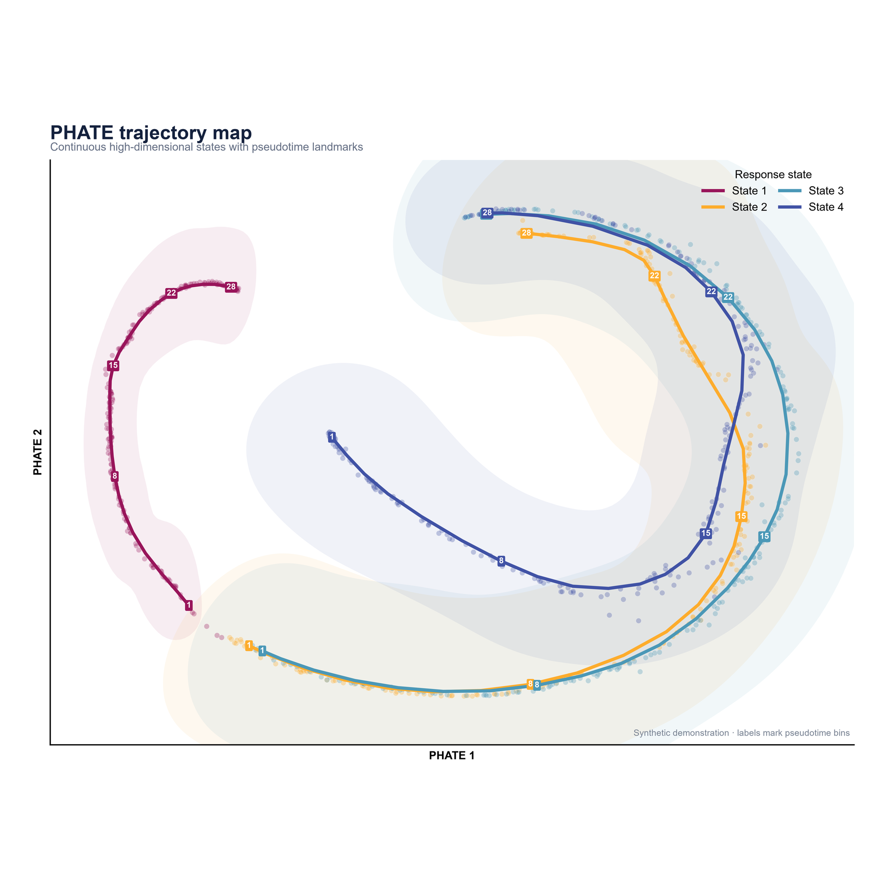

<p align="center">
  
</p>

<p align="center">
  <sub>语言 / Language：<strong>简体中文</strong> · <a href="README_EN.md">English</a></sub>
</p>

<p align="center">
  <strong>从研究问题到顶刊与发布场景级数据图</strong><br>
  <sub>同一份可信证据，分别适配论文近距阅读、演讲大屏与产品发布场景。</sub>
</p>

<p align="center">
  <a href="#它如何工作"></a>
  <a href="references/export-specs.md"></a>
  <a href="references/directory-map.md"></a>
  <a href="#质量证据"></a>
  <a href="https://github.com/Starry-cz/academic-data-visualization/actions/workflows/quality.yml"></a>
</p>

<p align="center">
  <a href="#使用入口">使用入口</a> ·
  <a href="#30-秒开始">30 秒开始</a> ·
  <a href="#精选成图">23 张成图</a> ·
  <a href="#它如何工作">工作流程</a> ·
  <a href="#它能帮你完成什么">核心能力</a> ·
  <a href="#质量证据">质量证据</a>
</p>

> **不是模板图库。** Skill 先判断研究问题、数据结构和投稿约束，再选择可辩护的图型；只有具备真实脚本、预览和 manifest 的资产才标记为生产模板。

## 使用入口

不必从头阅读。按照当前任务直接进入对应路径：

<table width="100%" align="center">
  <tr><th width="30%">你现在要做什么</th><th width="35%">直接入口</th><th width="35%">继续深入</th></tr>
  <tr><td width="30%">第一次安装并完成一张图</td><td width="35%"><a href="#30-秒开始">30 秒开始</a></td><td width="35%"><a href="#它如何工作">四阶段工作流</a></td></tr>
  <tr><td width="30%">先看真实成图与视觉风格</td><td width="35%"><a href="#精选成图">23 张精选成图</a></td><td width="35%"><a href="assets/figures/">生产资产目录</a> · <a href="#配色系统">配色系统</a></td></tr>
  <tr><td width="30%">查找图型、别名与实现状态</td><td width="35%"><a href="references/figure-type-catalog.md">图型目录</a> · <a href="references/chart-alias-index.md">别名索引</a></td><td width="35%"><a href="references/chart-registry.yaml">规范化注册表</a></td></tr>
  <tr><td width="30%">定义结论、版式与交付规格</td><td width="35%"><a href="references/figure-contract.md">图表契约</a> · <a href="references/figure-design-brief.md">设计简报</a></td><td width="35%"><a href="references/multipanel-layout.md">多面板布局</a> · <a href="references/visual-style.md">视觉样式</a></td></tr>
  <tr><td width="30%">适配期刊、演讲或发布会</td><td width="35%"><a href="references/delivery-profiles.md">交付场景</a> · <a href="references/journal-specs.md">期刊规格</a></td><td width="35%"><a href="references/export-specs.md">导出规格</a></td></tr>
  <tr><td width="30%">复用资产、配色并完成 QA</td><td width="35%"><a href="references/asset-reuse-protocol.md">资产复用协议</a> · <a href="references/color-palettes.md">配色指南</a></td><td width="35%"><a href="references/palette-library.json">配色注册表</a> · <a href="references/checklist.md">四轮 QA 清单</a></td></tr>
</table>

## 30 秒开始

**1. 安装完整 Skill。** 不要只复制 `SKILL.md`，运行时还需要 `references/`、`scripts/` 与 `assets/`。

```powershell
# Windows PowerShell · Codex
git clone https://github.com/Starry-cz/academic-data-visualization.git "$env:USERPROFILE\.codex\skills\academic-data-visualization"
```

```bash
# macOS / Linux · Codex
git clone https://github.com/Starry-cz/academic-data-visualization.git ~/.codex/skills/academic-data-visualization
```

**2. 直接描述研究问题、数据与交付规格。**

```text
使用 academic-data-visualization 分析 experiment.csv。
我要比较三种处理在四个时间点的变化。请先检查样本量、分布、缺失值和重复测量结构，
再论证图型与多面板方案；目标是双栏论文主图，交付可编辑矢量文件、符合目标期刊的 RGB 校样、
灰度校样和 QA 报告。
```

## 为什么值得使用

<table width="100%" align="center">
  <tr>
    <th width="25%">科学结论先行</th>
    <th width="25%">实现状态透明</th>
    <th width="25%">真实资产复用</th>
    <th width="25%">投稿前验证</th>
  </tr>
  <tr>
    <td width="25%">先判断读者需要比较、关联还是决策，再选择图型</td>
    <td width="25%">每条图型路线都会说明是直接复用、基于模式改造，还是按真实数据实现</td>
    <td width="25%">37 类资产具备脚本、预览和 manifest，可追溯复用</td>
    <td width="25%">同时检查反模式、代码与导出、科学逻辑和最终渲染结果</td>
  </tr>
</table>

传统绘图请求常从“画柱状图/热图”开始；本 Skill 从研究主张和数据契约开始，并主动拦截小样本均值柱、双 Y 轴、彩虹色图、错误连线、误导性截轴等常见风险。

## 它如何工作

<table width="100%" align="center">
  <tr><th width="20%">阶段</th><th width="60%">关键动作</th><th width="20%">产出</th></tr>
  <tr><td width="20%"><strong>1. 定义</strong></td><td width="60%">明确结论、观测单位、变量、依赖结构和交付场景</td><td width="20%"><a href="references/figure-contract.md">图表契约</a></td></tr>
  <tr><td width="20%"><strong>2. 论证</strong></td><td width="60%">剖析样本量、分布、缺失、异常值与分组，比较候选图型</td><td width="20%">图型理由与风险</td></tr>
  <tr><td width="20%"><strong>3. 实现</strong></td><td width="60%">路由生产模板、可复用模式或按需实现，统一面板与配色</td><td width="20%">Python / R 与矢量主文件</td></tr>
  <tr><td width="20%"><strong>4. 验证</strong></td><td width="60%">程序检查、最终尺寸 RGB 复核、灰度复核和导出审查</td><td width="20%">校样与 QA 报告</td></tr>
</table>

## 它能帮你完成什么

<!-- chart-registry:summary:start -->
Skill 把研究问题、数据结构和交付约束转换成一条可执行、可审查的成图路径；你不需要先从长长的图名清单里自行选择。

<table width="100%" align="center">
  <tr><th width="28%">你的情况</th><th width="44%">Skill 会怎么做</th><th width="28%">你会得到什么</th></tr>
  <tr><td width="28%"><strong>不知道该选什么图</strong></td><td width="44%">根据研究问题与真实数据结构比较可辩护的候选图型</td><td width="28%">选图理由与风险提示</td></tr>
  <tr><td width="28%"><strong>已有数据，需要尽快成图</strong></td><td width="44%">适合时复用 37 类已核验生产资产；不匹配时按真实数据实现</td><td width="28%">Python / R 脚本与可编辑矢量主文件</td></tr>
  <tr><td width="28%"><strong>需要统一多面板或旧图</strong></td><td width="44%">统一物理尺寸、字体、配色、图例与面板层级</td><td width="28%">符合期刊尺寸的主图或补充图</td></tr>
  <tr><td width="28%"><strong>正在准备投稿</strong></td><td width="44%">依次检查反模式、代码与导出、科学逻辑和最终渲染</td><td width="28%">RGB、灰度校样与 QA 报告</td></tr>
  <tr><td width="28%"><strong>需要演讲或产品发布数据图</strong></td><td width="44%">从同一分析结果派生 16:9 远距阅读版本，保留基线、不确定性与来源</td><td width="28%">SVG/PDF、1080p/4K 校样与替代文本</td></tr>
  <tr><td width="28%"><strong>需要专业领域图型</strong></td><td width="44%">使用真实专业实现，不用外形相似的普通图冒充</td><td width="28%">依赖、限制与替代方案说明</td></tr>
</table>

能力覆盖比较、趋势、分布、关联、降维、模型评估、医学、生物信息和空间分析等 24 类研究任务。需要完整索引时，可查看[图型目录](references/figure-type-catalog.md)或[真实生产资产](references/directory-map.md)。
<!-- chart-registry:summary:end -->

## 精选成图

首页按画幅展示 24 个不同类型的真实案例；统一缩略图画布确保每一行左右对齐，点击图片可查看原始成图。完整实现状态请进入 [生产资产目录](assets/figures/) 与 [图型目录](references/figure-type-catalog.md)。

### 关系、降维、诊断、高维与网络结构 · 3 × 4

<table width="100%" align="center">
  <tr>
    <td width="33%" colspan="2" align="center" valign="top"><strong>3D 热图</strong><br><a href="assets/figure-atlas/3Dheatmap.png"></a><br><sub>高维强度结构</sub></td>
    <td width="34%" colspan="2" align="center" valign="top"><strong>PCA 双标图</strong><br><a href="assets/figure-atlas/PCA.png"></a><br><sub>样本分离与载荷</sub></td>
    <td width="33%" colspan="2" align="center" valign="top"><strong>AUROC</strong><br><a href="assets/figure-atlas/auroc.png"></a><br><sub>模型判别能力</sub></td>
  </tr>
  <tr>
    <td width="33%" colspan="2" align="center" valign="top"><strong>相关密度图</strong><br><a href="assets/figure-atlas/CorrelationDensity.png"></a><br><sub>关系与局部密度</sub></td>
    <td width="34%" colspan="2" align="center" valign="top"><strong>相关矩阵</strong><br><a href="assets/figure-atlas/Correlationmatrix.png"></a><br><sub>多变量关系</sub></td>
    <td width="33%" colspan="2" align="center" valign="top"><strong>雷达图</strong><br><a href="assets/figure-atlas/radar.png"></a><br><sub>少量对象多指标</sub></td>
  </tr>
  <tr>
    <td width="33%" colspan="2" align="center" valign="top"><strong>山脊图</strong><br><a href="assets/figure-atlas/RidgePlot.png"></a><br><sub>多组分布迁移</sub></td>
    <td width="34%" colspan="2" align="center" valign="top"><strong>气泡散点图</strong><br><a href="assets/figures/BubbleScatter/bubble_scatter.png"></a><br><sub>二维关系与第三变量</sub></td>
    <td width="33%" colspan="2" align="center" valign="top"><strong>相关气泡矩阵</strong><br><a href="assets/figures/CorrelationBubbleMatrix/correlation_bubble_matrix.png"></a><br><sub>方向、强度与显著性</sub></td>
  </tr>
  <tr>
    <td width="33%" colspan="2" align="center" valign="top"><strong>相关网络图</strong><br><a href="assets/figures/CorrelationNetwork/correlation_network.png"></a><br><sub>节点关系与社群结构</sub></td>
    <td width="34%" colspan="2" align="center" valign="top"><strong>加权弦图</strong><br><a href="assets/figures/ChordDiagram/chord_diagram.png"></a><br><sub>跨领域连接、权重与整体结构</sub></td>
    <td width="33%" colspan="2" align="center" valign="top"><strong>PHATE 轨迹图</strong><br><a href="assets/figures/Manifold/phate_trajectory.png"></a><br><sub>高维状态、连续轨迹与局部密度</sub></td>
  </tr>
</table>

### 比较、分布、趋势、组成、空间与材料表征 · 2 × 6

<table width="100%" align="center">
  <tr>
    <td width="50%" align="center" valign="top"><strong>柱状图</strong><br><a href="assets/figure-atlas/bar.png"></a><br><sub>组间摘要与原始观测</sub></td>
    <td width="50%" align="center" valign="top"><strong>分组柱状图</strong><br><a href="assets/figure-atlas/GroupedBarChart.png"></a><br><sub>多处理 × 多指标</sub></td>
  </tr>
  <tr>
    <td width="50%" align="center" valign="top"><strong>Mantel 关联图</strong><br><a href="assets/figure-atlas/MantelCorrelation.png"></a><br><sub>距离矩阵与环境关联</sub></td>
    <td width="50%" align="center" valign="top"><strong>小提琴图</strong><br><a href="assets/figure-atlas/violin_chart.png"></a><br><sub>分布形态与异常值</sub></td>
  </tr>
  <tr>
    <td width="50%" align="center" valign="top"><strong>时间趋势</strong><br><a href="assets/figure-atlas/trend.png"></a><br><sub>变化轨迹与不确定性</sub></td>
    <td width="50%" align="center" valign="top"><strong>堆叠柱状散点图</strong><br><a href="assets/figure-atlas/StackedBarScatter.png"></a><br><sub>组成与样本级观测</sub></td>
  </tr>
  <tr>
    <td width="50%" align="center" valign="top"><strong>频率 3D 热图</strong><br><a href="assets/figure-atlas/Frequency_3DHeatmap.png"></a><br><sub>双因子分箱频次</sub></td>
    <td width="50%" align="center" valign="top"><strong>桑基图</strong><br><a href="assets/figure-atlas/sankey.png"></a><br><sub>类别流向与状态转换</sub></td>
  </tr>
  <tr>
    <td width="50%" align="center" valign="top"><strong>堆叠面积图</strong><br><a href="assets/figures/StackedArea/stacked_area.png"></a><br><sub>组成随时间变化</sub></td>
    <td width="50%" align="center" valign="top"><strong>地理气泡地图</strong><br><a href="assets/figures/GeographicBubbleMap/geographic_bubble_map.png"></a><br><sub>空间位置与规模编码</sub></td>
  </tr>
  <tr>
    <td width="50%" align="center" valign="top"><strong>XPS 峰拟合分峰图</strong><br><a href="assets/figures/XPSPeakDeconvolution/xps_peak_deconvolution.png"></a><br><sub>观测谱、总拟合、背景与化学组分</sub></td>
    <td width="50%" align="center" valign="top"><strong>EXAFS 小波变换图</strong><br><a href="assets/figures/EXAFSWaveletMap/exafs_wavelet_map.png"></a><br><sub>k–R 联合结构与二维定量投影</sub></td>
  </tr>
</table>

## 配色系统

23 套主题覆盖分类、顺序和发散语义；默认要求色盲友好、灰度可辨、语义稳定，并支持从参考图片提取候选颜色后重新审查。

<table width="100%" align="center">
  <tr>
    <td width="50%" align="center" valign="top"><strong>Nature default</strong><br></td>
    <td width="50%" align="center" valign="top"><strong>Blue–red signal</strong><br></td>
  </tr>
  <tr>
    <td width="50%" align="center" valign="top"><strong>Pastel harmony</strong><br></td>
    <td width="50%" align="center" valign="top"><strong>Coastal sunset</strong><br></td>
  </tr>
</table>

完整色值、语义角色与使用限制见 [`color-palettes.md`](references/color-palettes.md) 和 [`palette-library.json`](references/palette-library.json)。

## 适用边界

<table width="100%" align="center">
  <tr><th width="50%">适合</th><th width="50%">不适合</th></tr>
  <tr><td width="50%">论文主图、补充图、学术演讲和产品发布数据图</td><td width="50%">交互式仪表盘、Web 数据产品或完整幻灯片设计</td></tr>
  <tr><td width="50%">不确定该选什么图，需要基于数据结构论证</td><td width="50%">没有定量面板的纯插画式机制图</td></tr>
  <tr><td width="50%">重绘旧图、统一多面板语言、适配目标期刊</td><td width="50%">与绘图无关的统计分析、清洗或文献综述</td></tr>
  <tr><td width="50%">投稿前检查裁切、遮挡、灰度、误导编码和导出</td><td width="50%">要求用普通图假装地图、基因组轨道或三维体数据</td></tr>
</table>

## 更多安装方式

完整仓库中的 `references/`、`scripts/` 与 `assets/` 共同提供路由、约束、生产资产和质量检查，请勿只复制单个文件。

<details>
<summary><strong>Claude Code</strong></summary>

```bash
git clone https://github.com/Starry-cz/academic-data-visualization.git ~/.claude/skills/academic-data-visualization
```

</details>

<details>
<summary><strong>Cursor</strong></summary>

保留完整 Skill，并按项目需要使用 [`install/cursor/.cursorrules`](install/cursor/.cursorrules)。

</details>

<details>
<summary><strong>GitHub Copilot</strong></summary>

使用 [`install/copilot/copilot-instructions.md`](install/copilot/copilot-instructions.md) 作为仓库级指令。

</details>

更新已有安装：

```bash
git -C ~/.codex/skills/academic-data-visualization pull
```

## 质量证据

当前仓库基线：

- **714 / 714** 条源分类归属完成可复现映射；
- **37 / 37** 类生产图型均有真实脚本、PNG 与 manifest；
- **90 / 90** 条触发边界用例判断正确；
- **28 / 28** 个 QA 用例命中预期，覆盖 **15 / 15** 类程序检查；
- 注册表 Schema、24 类生成文档、别名冲突、资产映射与 README 摘要均由 CI 审计。

```bash
python scripts/check_skill_metadata.py
python scripts/check_references.py
python scripts/check_chart_registry.py
python scripts/build_chart_registry.py --check
python scripts/generate_chart_catalog.py --check
python -m unittest discover -s tests -v
python scripts/trigger_benchmark.py
python scripts/qa_coverage.py
python -m compileall -q scripts assets/figures tests
```

只有 [`checklist.md`](references/checklist.md) 中的反模式、代码与导出、科学逻辑、最终渲染四轮检查全部完成，结果才可标记为 `READY`。

<details>
<summary><strong>仓库结构</strong></summary>

```text
academic-data-visualization/
├── SKILL.md                 # 精简决策入口与按需路由
├── AGENTS.md                # 架构规则、生成文件与必跑检查
├── agents/openai.yaml       # Codex 展示与默认提示元数据
├── references/              # 注册表、24 类目录、选图、期刊、配色、导出与 QA
├── scripts/                 # 生成、校验、组合、配色与灰度校样
├── tests/                   # taxonomy、路由与生成结果回归测试
├── assets/                  # 生产脚本、manifest、图鉴与配色预览
└── install/                 # Codex / Claude Code / Cursor / Copilot 适配文件
```

</details>

## 贡献与许可

新增图型时，请先登记 canonical record、别名、分类与真实实现状态，再运行目录生成器。只有同时提交真实脚本、PNG 和 `asset.yaml` 的图型才能标记为 `production_template`；不得为未实现图型伪造预览或资产路径。完整要求见 [`AGENTS.md`](AGENTS.md)。

本项目采用 [Apache-2.0](LICENSE) 许可证。
