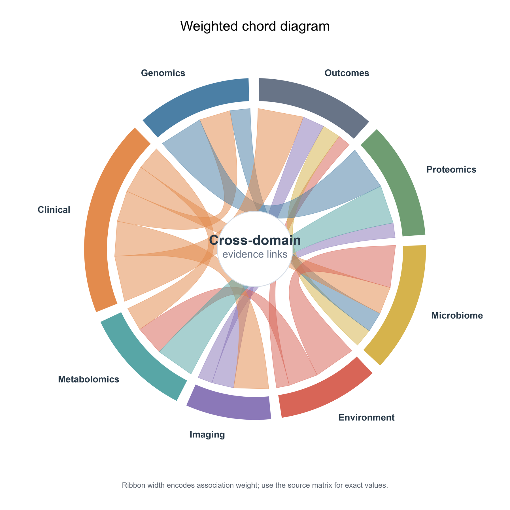
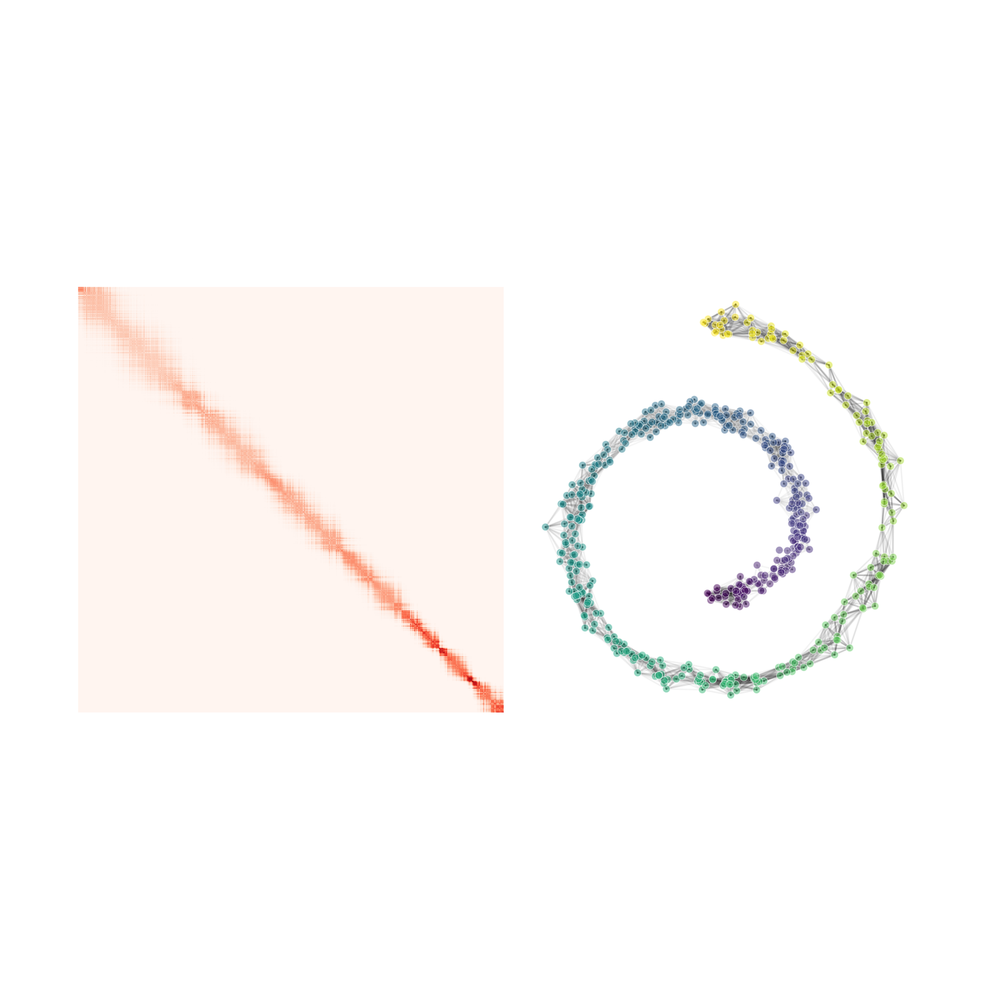
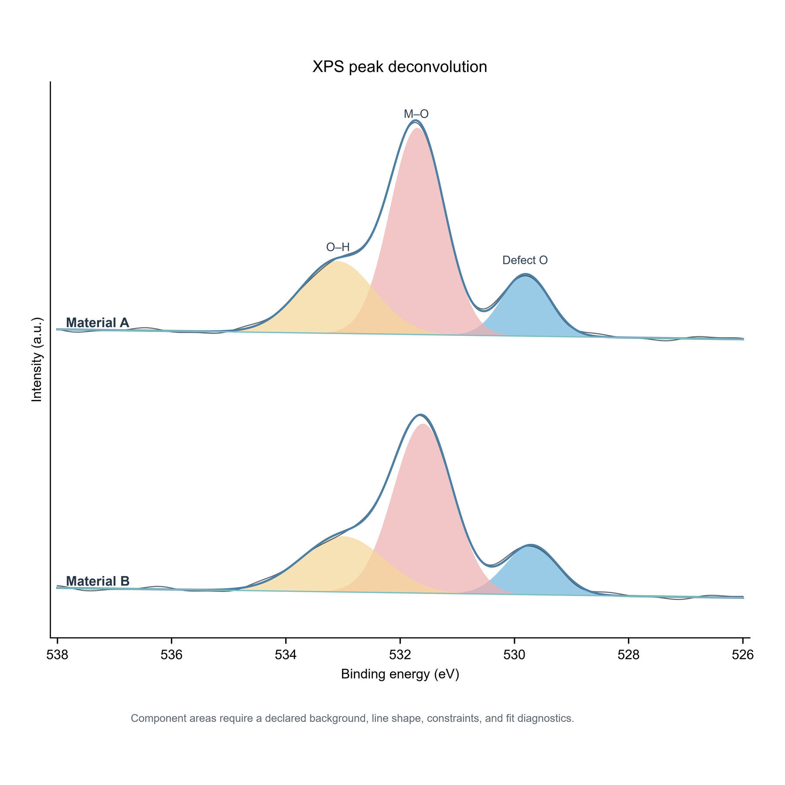
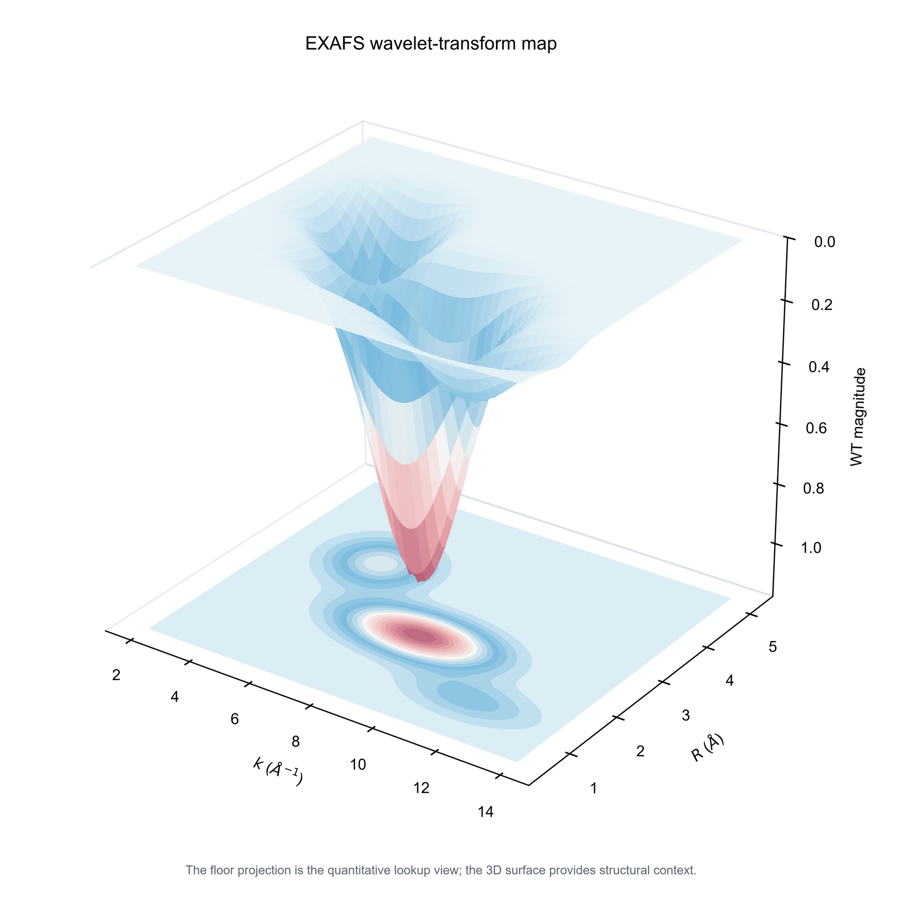

<p align="center">
  
</p>

<p align="center">
  <sub>Language / 语言: <a href="README.md">简体中文</a> · <strong>English</strong></sub>
</p>

<p align="center">
  <strong>From research question to journal- and launch-ready data graphics</strong><br>
  <sub>One evidence base, adapted separately for close manuscript reading and distant screen viewing.</sub>
</p>

<p align="center">
  <a href="#how-it-works"></a>
  <a href="references/export-specs.md"></a>
  <a href="references/directory-map.md"></a>
  <a href="#quality-evidence"></a>
  <a href="https://github.com/Starry-cz/academic-data-visualization/actions/workflows/quality.yml"></a>
</p>

<p align="center">
  <a href="#start-here">Start here</a> ·
  <a href="#30-second-start">30-second start</a> ·
  <a href="#selected-figures">23 figures</a> ·
  <a href="#how-it-works">Workflow</a> ·
  <a href="#what-it-helps-you-do">Capabilities</a> ·
  <a href="#quality-evidence">Quality</a>
</p>

> **Not a template gallery.** The Skill evaluates the research question, data structure, and submission constraints before selecting a defensible chart. Only assets with real scripts, previews, and manifests are marked as production templates.

## Start here

You do not need to read the README from top to bottom. Enter at the path that matches your task:

<table width="100%" align="center">
  <tr><th width="30%">What do you need?</th><th width="35%">Start here</th><th width="35%">Go deeper</th></tr>
  <tr><td width="30%">Install the Skill and make a first figure</td><td width="35%"><a href="#30-second-start">30-second start</a></td><td width="35%"><a href="#how-it-works">Four-stage workflow</a></td></tr>
  <tr><td width="30%">Inspect real outputs and visual styles</td><td width="35%"><a href="#selected-figures">23 selected figures</a></td><td width="35%"><a href="assets/figures/">Production assets</a> · <a href="#colour-system">Colour system</a></td></tr>
  <tr><td width="30%">Find a chart, alias, or implementation state</td><td width="35%"><a href="references/figure-type-catalog.md">Chart catalogue</a> · <a href="references/chart-alias-index.md">Alias index</a></td><td width="35%"><a href="references/chart-registry.yaml">Canonical registry</a></td></tr>
  <tr><td width="30%">Define the claim, layout, and deliverables</td><td width="35%"><a href="references/figure-contract.md">Figure contract</a> · <a href="references/figure-design-brief.md">Design brief</a></td><td width="35%"><a href="references/multipanel-layout.md">Multipanel layout</a> · <a href="references/visual-style.md">Visual style</a></td></tr>
  <tr><td width="30%">Match a journal, talk, or launch context</td><td width="35%"><a href="references/delivery-profiles.md">Delivery profiles</a> · <a href="references/journal-specs.md">Journal specs</a></td><td width="35%"><a href="references/export-specs.md">Export specs</a></td></tr>
  <tr><td width="30%">Reuse assets and colour, then complete QA</td><td width="35%"><a href="references/asset-reuse-protocol.md">Asset reuse protocol</a> · <a href="references/color-palettes.md">Colour guide</a></td><td width="35%"><a href="references/palette-library.json">Palette registry</a> · <a href="references/checklist.md">Four-pass QA</a></td></tr>
</table>

## 30-second start

**1. Install the complete Skill.** Do not copy `SKILL.md` alone: the runtime also needs `references/`, `scripts/`, and `assets/`.

```powershell
# Windows PowerShell · Codex
git clone https://github.com/Starry-cz/academic-data-visualization.git "$env:USERPROFILE\.codex\skills\academic-data-visualization"
```

```bash
# macOS / Linux · Codex
git clone https://github.com/Starry-cz/academic-data-visualization.git ~/.codex/skills/academic-data-visualization
```

**2. Describe the research question, data, and deliverables.**

```text
Use academic-data-visualization to analyse experiment.csv.
I need to compare three treatments at four time points. Profile sample sizes, distributions,
missingness, and repeated-measures structure before defending the chart and multipanel design.
Target a two-column manuscript figure and deliver an editable vector master, a journal-compliant RGB proof,
a grayscale proof, and a QA report.
```

## Why it is different

<table width="100%" align="center">
  <tr>
    <th width="25%">Scientific claim first</th>
    <th width="25%">Transparent status</th>
    <th width="25%">Real asset reuse</th>
    <th width="25%">Pre-submission verification</th>
  </tr>
  <tr>
    <td width="25%">Decide what readers must compare, relate, or judge before choosing a chart</td>
    <td width="25%">Every chart route states whether it is ready to reuse, adapted from a pattern, or built for the real data</td>
    <td width="25%">37 asset families include scripts, previews, and manifests</td>
    <td width="25%">Review anti-patterns, code and export, scientific logic, and the final rendering</td>
  </tr>
</table>

Conventional plotting requests start with “make a bar chart” or “draw a heatmap.” This Skill starts with the scientific claim and data contract, and actively blocks common risks such as small-sample mean bars, dual axes, rainbow maps, invalid connecting lines, and misleading truncation.

## How it works

<table width="100%" align="center">
  <tr><th width="20%">Stage</th><th width="60%">Key action</th><th width="20%">Output</th></tr>
  <tr><td width="20%"><strong>1. Define</strong></td><td width="60%">Fix the claim, observation unit, variables, dependence, and delivery context</td><td width="20%"><a href="references/figure-contract.md">Figure contract</a></td></tr>
  <tr><td width="20%"><strong>2. Defend</strong></td><td width="60%">Profile sample sizes, distributions, missingness, outliers, and groups; compare candidates</td><td width="20%">Rationale and risks</td></tr>
  <tr><td width="20%"><strong>3. Implement</strong></td><td width="60%">Route to a production template, reusable pattern, or on-demand build; unify panels and colour</td><td width="20%">Python / R and vector master</td></tr>
  <tr><td width="20%"><strong>4. Verify</strong></td><td width="60%">Run programmatic checks and inspect final-size RGB, grayscale, and export proofs</td><td width="20%">Proofs and QA report</td></tr>
</table>

## What it helps you do

<!-- chart-registry:summary:start -->
The Skill turns a research question, data structure, and delivery constraints into a defensible figure workflow; you do not need to choose from a long list of chart names.

<table width="100%" align="center">
  <tr><th width="28%">Your situation</th><th width="44%">What the Skill does</th><th width="28%">What you receive</th></tr>
  <tr><td width="28%"><strong>Unsure which chart to use</strong></td><td width="44%">Compare defensible candidates from the research question and real data structure</td><td width="28%">Chart rationale and risk notes</td></tr>
  <tr><td width="28%"><strong>Have data and need a figure</strong></td><td width="44%">Reuse one of 37 verified asset families when suitable; otherwise build for the actual data</td><td width="28%">Python / R script and editable vector master</td></tr>
  <tr><td width="28%"><strong>Need a coherent multipanel figure</strong></td><td width="44%">Unify physical size, typography, colour, legends, and panel hierarchy</td><td width="28%">Journal-sized main or supplementary figure</td></tr>
  <tr><td width="28%"><strong>Preparing a submission</strong></td><td width="44%">Run anti-pattern, code/export, scientific-logic, and final-render checks</td><td width="28%">RGB and grayscale proofs plus a QA report</td></tr>
  <tr><td width="28%"><strong>Need a keynote or product-launch chart</strong></td><td width="44%">Derive a 16:9 distant-reading view from the same analysis while preserving baselines, uncertainty, and source</td><td width="28%">SVG/PDF, 1080p/4K proofs, and alt text</td></tr>
  <tr><td width="28%"><strong>Need a specialist chart</strong></td><td width="44%">Use a genuine domain implementation instead of a generic visual look-alike</td><td width="28%">Dependencies, limitations, and alternatives</td></tr>
</table>

Coverage spans 24 research-task families, including comparison, trend, distribution, association, ordination, model evaluation, medicine, bioinformatics, and geospatial analysis. Browse the [chart catalogue](references/figure-type-catalog.md) or [verified production assets](references/directory-map.md) when you need the full index.
<!-- chart-registry:summary:end -->

## Selected figures

The landing page shows 24 verified examples across distinct chart families. Every thumbnail uses a fixed canvas so paired cells remain aligned; click an image for the original figure. Use the [production asset directory](assets/figures/) and [chart catalogue](references/figure-type-catalog.md) for complete implementation states.

### Relationships, ordination, diagnostics, high-dimensional, and network structure · 3 × 4

<table width="100%" align="center">
  <tr>
    <td width="33%" colspan="2" align="center" valign="top"><strong>3D heatmap</strong><br><a href="assets/figure-atlas/3Dheatmap.png"></a><br><sub>High-dimensional intensity</sub></td>
    <td width="34%" colspan="2" align="center" valign="top"><strong>PCA biplot</strong><br><a href="assets/figure-atlas/PCA.png"></a><br><sub>Sample separation and loadings</sub></td>
    <td width="33%" colspan="2" align="center" valign="top"><strong>AUROC</strong><br><a href="assets/figure-atlas/auroc.png"></a><br><sub>Model discrimination</sub></td>
  </tr>
  <tr>
    <td width="33%" colspan="2" align="center" valign="top"><strong>Correlation density</strong><br><a href="assets/figure-atlas/CorrelationDensity.png"></a><br><sub>Relationships and local density</sub></td>
    <td width="34%" colspan="2" align="center" valign="top"><strong>Correlation matrix</strong><br><a href="assets/figure-atlas/Correlationmatrix.png"></a><br><sub>Multivariable relationships</sub></td>
    <td width="33%" colspan="2" align="center" valign="top"><strong>Radar plot</strong><br><a href="assets/figure-atlas/radar.png"></a><br><sub>Few objects, many metrics</sub></td>
  </tr>
  <tr>
    <td width="33%" colspan="2" align="center" valign="top"><strong>Ridge plot</strong><br><a href="assets/figure-atlas/RidgePlot.png"></a><br><sub>Distribution shifts</sub></td>
    <td width="34%" colspan="2" align="center" valign="top"><strong>Bubble scatter</strong><br><a href="assets/figures/BubbleScatter/bubble_scatter.png"></a><br><sub>2D relationship plus size</sub></td>
    <td width="33%" colspan="2" align="center" valign="top"><strong>Correlation bubbles</strong><br><a href="assets/figures/CorrelationBubbleMatrix/correlation_bubble_matrix.png"></a><br><sub>Direction, strength, significance</sub></td>
  </tr>
  <tr>
    <td width="33%" colspan="2" align="center" valign="top"><strong>Correlation network</strong><br><a href="assets/figures/CorrelationNetwork/correlation_network.png"></a><br><sub>Edges and community structure</sub></td>
    <td width="34%" colspan="2" align="center" valign="top"><strong>Weighted chord diagram</strong><br><a href="assets/figures/ChordDiagram/chord_diagram.png"></a><br><sub>Cross-domain links, weights, and global structure</sub></td>
    <td width="33%" colspan="2" align="center" valign="top"><strong>Manifold embedding</strong><br><a href="assets/figures/Manifold/diffusion_swiss_roll.png"></a><br><sub>Nonlinear high-dimensional structure and local neighborhoods</sub></td>
  </tr>
</table>

### Comparison, distribution, trend, composition, space, and materials · 2 × 6

<table width="100%" align="center">
  <tr>
    <td width="50%" align="center" valign="top"><strong>Bar plot</strong><br><a href="assets/figure-atlas/bar.png"></a><br><sub>Group summaries and observations</sub></td>
    <td width="50%" align="center" valign="top"><strong>Grouped bars</strong><br><a href="assets/figure-atlas/GroupedBarChart.png"></a><br><sub>Multiple treatments × metrics</sub></td>
  </tr>
  <tr>
    <td width="50%" align="center" valign="top"><strong>Mantel correlation</strong><br><a href="assets/figure-atlas/MantelCorrelation.png"></a><br><sub>Distance matrices and environment</sub></td>
    <td width="50%" align="center" valign="top"><strong>Violin plot</strong><br><a href="assets/figure-atlas/violin_chart.png"></a><br><sub>Distribution shape and outliers</sub></td>
  </tr>
  <tr>
    <td width="50%" align="center" valign="top"><strong>Time trend</strong><br><a href="assets/figure-atlas/trend.png"></a><br><sub>Trajectories and uncertainty</sub></td>
    <td width="50%" align="center" valign="top"><strong>Stacked bar + scatter</strong><br><a href="assets/figure-atlas/StackedBarScatter.png"></a><br><sub>Composition and observations</sub></td>
  </tr>
  <tr>
    <td width="50%" align="center" valign="top"><strong>Frequency 3D heatmap</strong><br><a href="assets/figure-atlas/Frequency_3DHeatmap.png"></a><br><sub>Two-factor binned frequency</sub></td>
    <td width="50%" align="center" valign="top"><strong>Sankey diagram</strong><br><a href="assets/figure-atlas/sankey.png"></a><br><sub>Category flows and transitions</sub></td>
  </tr>
  <tr>
    <td width="50%" align="center" valign="top"><strong>Stacked area</strong><br><a href="assets/figures/StackedArea/stacked_area.png"></a><br><sub>Composition over time</sub></td>
    <td width="50%" align="center" valign="top"><strong>Geographic bubble map</strong><br><a href="assets/figures/GeographicBubbleMap/geographic_bubble_map.png"></a><br><sub>Location and magnitude</sub></td>
  </tr>
  <tr>
    <td width="50%" align="center" valign="top"><strong>XPS peak deconvolution</strong><br><a href="assets/figures/XPSPeakDeconvolution/xps_peak_deconvolution.png"></a><br><sub>Observed spectrum, total fit, background, and chemical components</sub></td>
    <td width="50%" align="center" valign="top"><strong>EXAFS wavelet-transform map</strong><br><a href="assets/figures/EXAFSWaveletMap/exafs_wavelet_map.png"></a><br><sub>Joint k–R structure with a quantitative 2D projection</sub></td>
  </tr>
</table>

## Colour system

Twenty-three themes cover categorical, sequential, and diverging semantics. The defaults require colour-blind safety, grayscale legibility, stable meaning, and a review step when colours are extracted from reference images.

<table width="100%" align="center">
  <tr>
    <td width="50%" align="center" valign="top"><strong>Nature default</strong><br></td>
    <td width="50%" align="center" valign="top"><strong>Blue–red signal</strong><br></td>
  </tr>
  <tr>
    <td width="50%" align="center" valign="top"><strong>Pastel harmony</strong><br></td>
    <td width="50%" align="center" valign="top"><strong>Coastal sunset</strong><br></td>
  </tr>
</table>

See [`color-palettes.md`](references/color-palettes.md) and [`palette-library.json`](references/palette-library.json) for complete values, semantic roles, and usage constraints.

## Scope boundaries

<table width="100%" align="center">
  <tr><th width="50%">Good fit</th><th width="50%">Out of scope</th></tr>
  <tr><td width="50%">Manuscripts, supplements, scientific talks, and product-launch data graphics</td><td width="50%">Interactive dashboards, web data products, or complete slide-deck design</td></tr>
  <tr><td width="50%">Choosing a defensible chart from the real data structure</td><td width="50%">Illustration-only mechanisms with no quantitative panels</td></tr>
  <tr><td width="50%">Rebuilding old figures, unifying panels, or adapting to a journal</td><td width="50%">Statistical analysis, cleaning, or literature review with no figure goal</td></tr>
  <tr><td width="50%">Pre-submission checks for clipping, overlap, grayscale, encodings, and export</td><td width="50%">Pretending that a generic chart is a map, genome track, or 3D volume</td></tr>
</table>

## More installation options

The complete repository matters: `references/`, `scripts/`, and `assets/` jointly provide routing, constraints, production assets, and QA. Do not copy a single file.

<details>
<summary><strong>Claude Code</strong></summary>

```bash
git clone https://github.com/Starry-cz/academic-data-visualization.git ~/.claude/skills/academic-data-visualization
```

</details>

<details>
<summary><strong>Cursor</strong></summary>

Keep the complete Skill and use [`install/cursor/.cursorrules`](install/cursor/.cursorrules) where appropriate.

</details>

<details>
<summary><strong>GitHub Copilot</strong></summary>

Use [`install/copilot/copilot-instructions.md`](install/copilot/copilot-instructions.md) as repository instructions.

</details>

Update an existing installation with:

```bash
git -C ~/.codex/skills/academic-data-visualization pull
```

## Quality evidence

Current repository baseline:

- **714 / 714** source memberships are reproducibly mapped;
- **37 / 37** production asset families contain real scripts, PNGs, and manifests;
- **90 / 90** trigger-boundary cases classify correctly;
- **28 / 28** QA fixtures hit their expected results across **15 / 15** programmatic checks;
- CI audits the registry schema, 24 generated category documents, alias conflicts, asset mapping, and README summaries.

```bash
python scripts/check_skill_metadata.py
python scripts/check_references.py
python scripts/check_chart_registry.py
python scripts/build_chart_registry.py --check
python scripts/generate_chart_catalog.py --check
python -m unittest discover -s tests -v
python scripts/trigger_benchmark.py
python scripts/qa_coverage.py
python -m compileall -q scripts assets/figures tests
```

A result is marked `READY` only after all four passes in [`checklist.md`](references/checklist.md): anti-patterns, code and export, scientific logic, and final rendering.

<details>
<summary><strong>Repository structure</strong></summary>

```text
academic-data-visualization/
├── SKILL.md                 # Concise decision entry point and on-demand routing
├── AGENTS.md                # Architecture, generated-file, and validation rules
├── agents/openai.yaml       # Codex display and default-prompt metadata
├── references/              # Registry, 24-category catalogue, journals, colour, export, and QA
├── scripts/                 # Generation, validation, composition, colour, and grayscale tools
├── tests/                   # Taxonomy, routing, and generated-output regression tests
├── assets/                  # Production scripts, manifests, atlas, and palette previews
└── install/                 # Codex / Claude Code / Cursor / Copilot adapters
```

</details>

## Contributing and licence

Register the canonical record, aliases, categories, and real implementation state before adding a chart, then run the catalogue generator. A chart may be marked `production_template` only when its real script, PNG, and `asset.yaml` are committed together. Never fabricate previews or asset paths for unimplemented charts. See [`AGENTS.md`](AGENTS.md) for the complete rules.

Licensed under [Apache-2.0](LICENSE).
