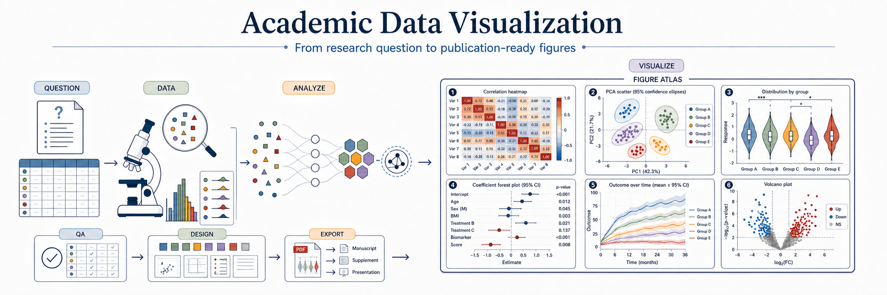

<p align="center">
  
</p>

<h1 align="center">Academic Data Visualization</h1>

<p align="center">
  <strong>Think first, plot second: turn scientific questions and real data into reproducible, reviewable, submission-ready Python / R figures.</strong>
</p>

<p align="center">
  <a href="#one-minute-start"></a>
  <a href="references/figure-type-catalog.md"></a>
  <a href="#palette-library"></a>
  <a href="#reproducible-quality-evidence"></a>
  <a href="LICENSE"></a>
</p>

<p align="center">
  <a href="#one-minute-start">One-minute start</a> ·
  <a href="#what-it-solves">Scope</a> ·
  <a href="references/figure-type-catalog.md">Figure catalogue</a> ·
  <a href="#production-figure-gallery">Production figures</a> ·
  <a href="#palette-library">Palettes</a> ·
  <a href="#reproducible-quality-evidence">Quality evidence</a> ·
  <a href="#installation-and-updates">Install</a> ·
  <a href="README.md">中文</a>
</p>

> This is not a template collection that forces data into a preset chart. The skill establishes the claim, unit of observation, data structure, and target journal before selecting a chart, organizing panels, reusing production assets, and reviewing final-size RGB and grayscale proofs.

## What it solves

<table width="100%" style="width:100%">
  <thead>
    <tr><th width="30%">A typical plotting request</th><th width="70%">Academic Data Visualization</th></tr>
  </thead>
  <tbody>
    <tr><td>Starts from a bar, heatmap, or scatter template</td><td>Starts from what the reader must compare, relate, or decide</td></tr>
    <tr><td>Often ignores sample size, distribution, and dependence</td><td>Profiles variable types, missingness, group sizes, outliers, and repeated measures</td></tr>
    <tr><td>Beautifies with default colours and a fixed grid</td><td>Builds a visual system from data semantics, journal size, and evidence hierarchy</td></tr>
    <tr><td>Stops when the script runs</td><td>Runs programmatic QA, final-size visual review, and a grayscale proof</td></tr>
    <tr><td>Delivers one PNG</td><td>Delivers code, vector masters, high-resolution proofs, and a QA report</td></tr>
  </tbody>
</table>

<table width="100%" style="width:100%">
  <thead>
    <tr>
      <th width="30%" align="left">Scale</th>
      <th width="70%" align="left">Included in this repository</th>
    </tr>
  </thead>
  <tbody>
    <tr><td width="30%"><strong>96 figure patterns</strong></td><td width="70%">Six atlas groups × 16 verified patterns; nine specialist selection categories are implemented on demand</td></tr>
    <tr><td><strong>29 production asset families</strong></td><td>Python / R scripts, data constraints, and verifiable previews</td></tr>
    <tr><td><strong>20 palette themes</strong></td><td>Categorical, diverging, sequential, and reference-image personalization workflows</td></tr>
    <tr><td><strong>4 QA passes</strong></td><td>Anti-pattern, code/export, scientific logic, and rendered-proof review</td></tr>
  </tbody>
</table>

### Good fit

- Manuscript main figures, supplementary figures, theses, and scientific reports;
- Data where the defensible chart is not yet clear;
- Rebuilding an old figure, unifying a multi-panel visual language, or adapting to a journal;
- Pre-submission checks for overlap, clipping, misleading encodings, colour, and export risks.

### Out of scope

- Interactive dashboards, web data products, or slide-deck layout;
- Illustration-first mechanism diagrams with no quantitative panels;
- Statistical analysis, data cleaning, or literature review with no figure-making goal.

## One-minute start

### 1. Install the complete skill

Windows PowerShell:

```powershell
git clone https://github.com/Starry-cz/academic-data-visualization.git "$env:USERPROFILE\.codex\skills\academic-data-visualization"
```

macOS / Linux:

```bash
git clone https://github.com/Starry-cz/academic-data-visualization.git ~/.codex/skills/academic-data-visualization
```

Install the **entire directory**, not `SKILL.md` alone. The `references/`, `scripts/`, and `assets/` directories provide the chart constraints, QA, and production assets.

### 2. Say this directly

```text
Use academic-data-visualization to analyse experiment.csv.
I need to compare three interventions across four time points. Profile sample size,
distribution, and repeated-measure structure before justifying the chart and panel plan.
Target a double-column manuscript figure and deliver editable vector masters, a 450 dpi
proof, a grayscale proof, and a QA report.
```

### More copy-ready prompts

<table width="100%" style="width:100%">
  <thead>
    <tr><th width="16%">Situation</th><th width="84%">Prompt</th></tr>
  </thead>
  <tbody>
    <tr><td>Unsure which chart to use</td><td><code>Profile experiment.csv and recommend a chart from the research claim, variable types, sample size, distribution, and grouping. Do not start from a template.</code></td></tr>
    <tr><td>Build a main figure</td><td><code>Organize these results into a submission-ready multi-panel main figure. State what each panel answers and how the panels form one evidence chain.</code></td></tr>
    <tr><td>Rebuild an old figure</td><td><code>Use old_figure.png and source_data.csv to rebuild an editable figure. Preserve the data meaning rather than merely beautifying the screenshot.</code></td></tr>
    <tr><td>Adapt to a journal</td><td><code>Audit and rebuild figure.py for a Nature double-column figure, including type, width, colour, statistics, and export.</code></td></tr>
    <tr><td>Audit before submission</td><td><code>Audit this figure for chart validity, clipping, legend occlusion, grayscale readability, vector text, and data-expression risks.</code></td></tr>
  </tbody>
</table>

## How it works

<table width="100%" style="width:100%">
  <thead>
    <tr><th width="18%">Stage</th><th width="52%">What the skill completes</th><th width="30%">Main artifact</th></tr>
  </thead>
  <tbody>
    <tr><td><strong>1. Figure contract</strong></td><td>Establish the question, claim, unit of observation, and target journal</td><td>One-sentence claim + panel data contract</td></tr>
    <tr><td><strong>2. Data profile</strong></td><td>Check types, missingness, group sizes, distributions, outliers, and dependence</td><td>Claim-directed data summary</td></tr>
    <tr><td><strong>3. Chart justification</strong></td><td>Select the chart and intercept misleading alternatives</td><td>Primary plan + alternatives + rationale</td></tr>
    <tr><td><strong>4. Visual system</strong></td><td>Fix final size, hierarchy, type, colour roles, and backend</td><td>Multi-panel design brief</td></tr>
    <tr><td><strong>5. Build and reuse</strong></td><td>Classify each panel as native reuse, visual adaptation, or new implementation</td><td>Reproducible Python / R scripts</td></tr>
    <tr><td><strong>6. Review and deliver</strong></td><td>Run four-pass QA, inspect RGB / grayscale proofs, revise, and export</td><td>PDF / SVG, 450 dpi proof, QA report</td></tr>
  </tbody>
</table>

## Production figure gallery

The cards below retain only representative production assets rather than repeating every figure route. See [`references/figure-type-catalog.md`](references/figure-type-catalog.md) for the complete selection scope, constraints, and implementation levels. Before reuse, the skill checks semantic and structural compatibility and classifies the panel as native reuse, visual adaptation, or a new implementation.

<table width="100%" style="width:100%">
  <tr>
    <td width="33%" align="center" valign="top"><strong>3D heatmap</strong><br><a href="assets/figure-atlas/3Dheatmap.png"></a><br><sub>Multifactor interactions and intensity matrices</sub></td>
    <td width="33%" align="center" valign="top"><strong>AUROC curve</strong><br><a href="assets/figure-atlas/auroc.png"></a><br><sub>Classifier and threshold sensitivity</sub></td>
    <td width="33%" align="center" valign="top"><strong>Bar chart</strong><br><a href="assets/figure-atlas/bar.png"></a><br><sub>Group summaries, uncertainty, and observations</sub></td>
  </tr>
  <tr>
    <td align="center" valign="top"><strong>Correlation-density plot</strong><br><a href="assets/figure-atlas/CorrelationDensity.png"></a><br><sub>Bivariate relation, density, and outliers</sub></td>
    <td align="center" valign="top"><strong>Correlation matrix</strong><br><a href="assets/figure-atlas/Correlationmatrix.png"></a><br><sub>Multivariable relations and collinearity</sub></td>
    <td align="center" valign="top"><strong>Density heatmap</strong><br><a href="assets/figure-atlas/density_heatmap.png"></a><br><sub>Large point clouds and 2D density</sub></td>
  </tr>
  <tr>
    <td align="center" valign="top"><strong>Frequency 3D heatmap</strong><br><a href="assets/figure-atlas/Frequency_3DHeatmap.png"></a><br><sub>Binned frequency and two-factor counts</sub></td>
    <td align="center" valign="top"><strong>Grouped correlation matrix</strong><br><a href="assets/figure-atlas/GroupCorrelationmatrix.png"></a><br><sub>Correlation structure across conditions</sub></td>
    <td align="center" valign="top"><strong>Grouped bar chart</strong><br><a href="assets/figure-atlas/GroupedBarChart.png"></a><br><sub>Multi-treatment × multi-metric comparison</sub></td>
  </tr>
  <tr>
    <td align="center" valign="top"><strong>Mantel test</strong><br><a href="assets/figure-atlas/MantelCorrelation.png"></a><br><sub>Distance-matrix and environment links</sub></td>
    <td align="center" valign="top"><strong>PCA biplot</strong><br><a href="assets/figure-atlas/PCA.png"></a><br><sub>Separation, reduction, and loadings</sub></td>
    <td align="center" valign="top"><strong>Radar chart</strong><br><a href="assets/figure-atlas/radar.png"></a><br><sub>Multimetric profiles for a few objects</sub></td>
  </tr>
  <tr>
    <td align="center" valign="top"><strong>Ridge plot</strong><br><a href="assets/figure-atlas/RidgePlot.png"></a><br><sub>Distribution shifts and overlap</sub></td>
    <td align="center" valign="top"><strong>Sankey diagram</strong><br><a href="assets/figure-atlas/sankey.png"></a><br><sub>Category flow and state transitions</sub></td>
    <td align="center" valign="top"><strong>Stacked-bar scatter</strong><br><a href="assets/figure-atlas/StackedBarScatter.png"></a><br><sub>Composition plus sample-level observations</sub></td>
  </tr>
  <tr>
    <td align="center" valign="top"><strong>Trend plot</strong><br><a href="assets/figure-atlas/trend.png"></a><br><sub>Time, dose, and environmental gradients</sub></td>
    <td align="center" valign="top"><strong>Violin plot</strong><br><a href="assets/figure-atlas/violin_chart.png"></a><br><sub>Shape, spread, and outliers</sub></td>
    <td align="center" valign="middle"><strong>More figure types</strong><br><a href="references/figure-type-catalog.md">Open the complete catalogue and selection constraints →</a></td>
  </tr>
</table>

## Palette library

The default is `nature-default`; the README previews use different themes by figure type, with `warm-cool-kinetics` reserved for kinetic plots. Each theme defines categorical, diverging, and sequential roles rather than supplying disconnected hex values.

<table width="100%" style="width:100%">
  <tr>
    <td width="50%" align="center" valign="top"><strong>Nature default · nature-default</strong><br></td>
    <td width="50%" align="center" valign="top"><strong>Vivid signal · vivid-signal</strong><br></td>
  </tr>
  <tr>
    <td align="center" valign="top"><strong>Bright bio · bright-bio</strong><br></td>
    <td align="center" valign="top"><strong>Teal genome · teal-genome</strong><br></td>
  </tr>
  <tr>
    <td align="center" valign="top"><strong>Muted microbe · muted-microbe</strong><br></td>
    <td align="center" valign="top"><strong>Immuno signal · immuno-signal</strong><br></td>
  </tr>
  <tr>
    <td align="center" valign="top"><strong>Pastel catalysis · pastel-catalysis</strong><br></td>
    <td align="center" valign="top"><strong>Electrochemistry · electrochemistry</strong><br></td>
  </tr>
  <tr>
    <td align="center" valign="top"><strong>Soft cost · soft-cost</strong><br></td>
    <td align="center" valign="top"><strong>Soft academic · soft-academic</strong><br></td>
  </tr>
  <tr>
    <td align="center" valign="top"><strong>Pastel omics · pastel-omics</strong><br></td>
    <td align="center" valign="top"><strong>Warm-cool kinetics · warm-cool-kinetics</strong><br></td>
  </tr>
  <tr>
    <td align="center" valign="top"><strong>Aquifer recovery · aquifer-recovery</strong><br></td>
    <td align="center" valign="top"><strong>Neuro navy · neuro-navy</strong><br></td>
  </tr>
  <tr>
    <td align="center" valign="top"><strong>Cryo electrolyte · cryo-electrolyte</strong><br></td>
    <td align="center" valign="top"><strong>Literature clinical · literature-clinical</strong><br></td>
  </tr>
  <tr>
    <td align="center" valign="top"><strong>Sage methods · sage-methods</strong><br></td>
    <td align="center" valign="top"><strong>Quiet atlas · quiet-atlas</strong><br></td>
  </tr>
  <tr>
    <td align="center" valign="top"><strong>Method blueprint · method-blueprint</strong><br></td>
    <td align="center" valign="top"><strong>Ablation contrast · ablation-contrast</strong><br></td>
  </tr>
</table>

After the first reviewed render, the skill asks whether to keep the theme or redraw with another library theme, user-supplied hex values, a palette image, or a reference paper figure. Recolouring changes visual roles only; it does not change data, statistics, chart type, group order, or colour semantics.

## Reproducible quality evidence

Current repository baseline:

- **40 / 40** trigger prompts classified correctly, including positive and negative cases;
- **29 / 29** production figure families have parseable scripts;
- **26 / 26** QA fixtures hit their expected targets across **15 / 15** programmatic checks;
- the composition engine passes column-width, 450 dpi, TrueType embedding, vector-export, and palette checks.

```bash
# Skill structure and trigger accuracy
python scripts/trigger_benchmark.py

# Reference, production-asset, and QA coverage
python scripts/check_references.py
python scripts/qa_coverage.py
python scripts/eval_runner.py --report-only

# Audit a real plotting script
python scripts/qa_validator.py path/to/figure.py

# Create a grayscale readability proof
python scripts/grayscale_proof.py figure-proof.png --output figure-proof-grayscale.png
```

The verdict follows [`references/checklist.md`](references/checklist.md). A figure is marked `READY` only after anti-pattern, code/export, scientific-logic, and rendered-proof passes are complete.

## Installation and updates

<table width="100%" style="width:100%">
  <thead>
    <tr><th width="30%">Platform</th><th width="70%">Integration</th></tr>
  </thead>
  <tbody>
    <tr><td><strong>Codex</strong></td><td>Put the complete repository in <code>~/.codex/skills/academic-data-visualization/</code></td></tr>
    <tr><td><strong>Claude Code</strong></td><td>Put the complete repository in <code>~/.claude/skills/academic-data-visualization/</code></td></tr>
    <tr><td><strong>Cursor</strong></td><td>Use the complete skill and optionally copy <a href="install/cursor/.cursorrules">install/cursor/.cursorrules</a></td></tr>
    <tr><td><strong>GitHub Copilot</strong></td><td>Use <a href="install/copilot/copilot-instructions.md">install/copilot/copilot-instructions.md</a></td></tr>
  </tbody>
</table>

Update a retained clone with:

```bash
git -C ~/.codex/skills/academic-data-visualization pull
```

Windows PowerShell:

```powershell
git -C "$env:USERPROFILE\.codex\skills\academic-data-visualization" pull
```

## Repository layout

```text
academic-data-visualization/
├── SKILL.md                 # concise decision entry and conditional routing
├── agents/openai.yaml       # Codex display and default-prompt metadata
├── references/              # selection, journal, colour, layout, reuse, export, and QA
├── scripts/                 # composition, validation, thumbnail, palette, and grayscale tools
├── assets/                  # production scripts, curated thumbnails, palette previews, and internal test assets
└── install/                 # Codex / Cursor / Copilot / Claude adapters
```

## Design references and acknowledgements

The README and workflow independently adapt strong public patterns: progressive disclosure from [GPT-Image2-Skill](https://github.com/wuyoscar/GPT-Image2-Skill), visual proof from real production scripts in [figures4papers](https://github.com/ChenLiu-1996/figures4papers), problem-driven planning and multi-pass QA from [academic-figure-skill](https://github.com/TingxiYu/academic-figure-skill), advisor-first profiling and rendered-proof review from [scipilot-figure-skill](https://github.com/Haojae/scipilot-figure-skill), and quick-start plus journal-style examples from [SciencePlots](https://github.com/garrettj403/SciencePlots). No scripts or generated figures from these projects are copied here.

## Contributing and license

Contributions are welcome for journal specifications, accessibility improvements, real research scenarios, and new figure types. A new production template should include a reproducible script, data assumptions, a rendered preview, and QA results.

Licensed under [Apache-2.0](LICENSE).
